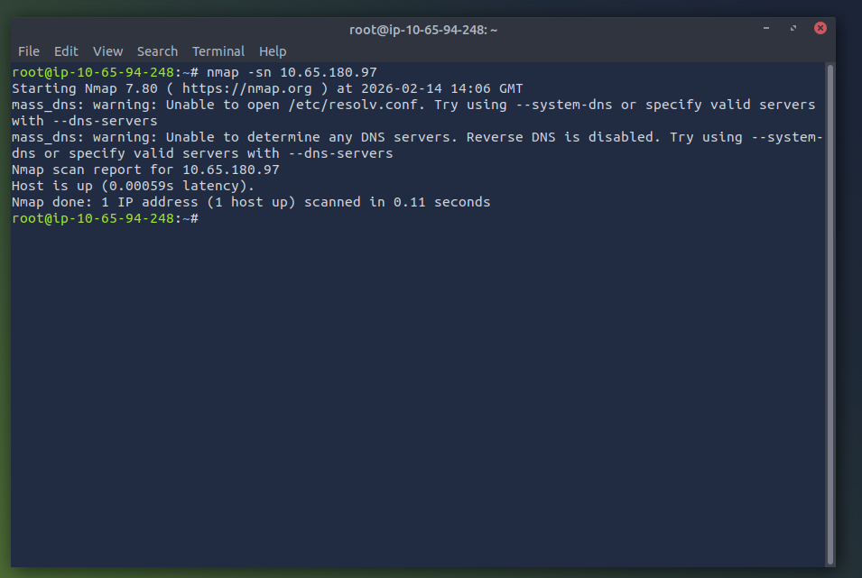
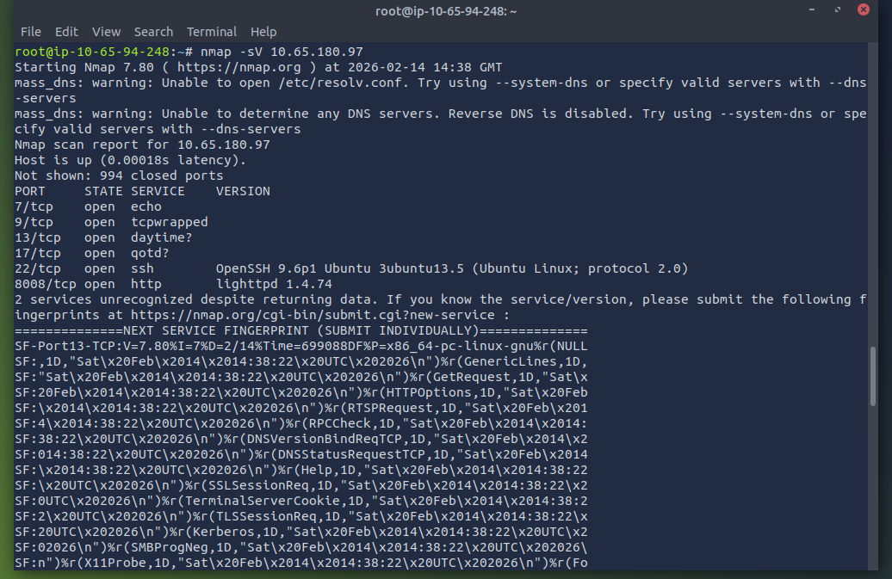
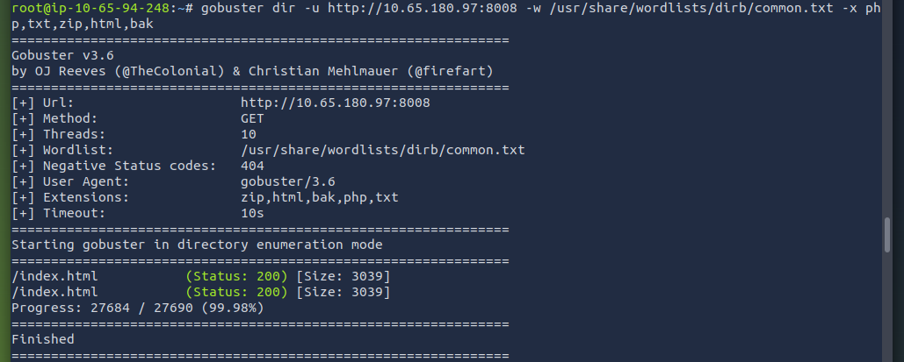
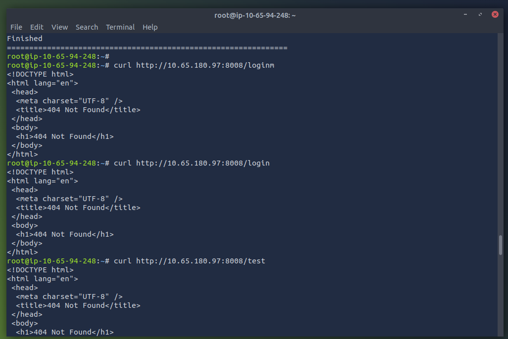

# Network-Asset-Discovery-Exposure-Report

Sobre o Projeto

Este projeto tem como objetivo realizar a descoberta de ativos de rede, identificar serviços expostos e analisar riscos de segurança em um ambiente controlado da plataforma TryHackMe.

A proposta é simular o trabalho de um analista de SOC (Blue Team), focando na identificação da superfície de ataque e na prevenção de possíveis ameaças.

# - Objetivos

*  Identificar hosts ativos na rede

*  Descobrir portas e serviços expostos

*  Analisar versões e possíveis vulnerabilidades

*  Avaliar riscos de segurança

*  Desenvolver mentalidade defensiva

*  Produzir um relatório profissional

# - Competências Desenvolvidas

Habilidades práticas:

*  Reconhecimento de rede
  
*  Enumeração de serviços
  
*  Análise de exposição
  
*  Investigação de ativos
  
*  Pensamento defensivo
  
*  Documentação técnica

# - Ferramentas Utilizadas

Durante este projeto foram utilizadas ferramentas comuns em ambientes corporativos:

*  Scanner de rede

*  Ferramentas de enumeração

*  Análise de serviços

*  Investigação web

# - Ambiente

*  Laboratório controlado da plataforma TryHackMe, simulando um cenário real de análise de exposição.

# - Metodologia

1️⃣ Descoberta de ativos

*  Identificação de hosts ativos para mapear a superfície de ataque.

2️⃣ Enumeração de portas

*  Análise das portas abertas e serviços expostos externamente.

  

3️⃣ Identificação de versões

*  Coleta de informações sobre tecnologias e sistemas utilizados.

4️⃣ Enumeração Web

Análise do serviço HTTP para identificar:

*  Diretórios ocultos

*  Tentativa de achar APIs, Login, Admin:

*  Login:

*  Vazamento de informações

*  Configurações inseguras

5️⃣ Avaliação de risco

Classificação dos achados com base no impacto e probabilidade.

# - Principais Descobertas

✔ Host ativo identificado
✔ Serviços críticos acessíveis externamente
✔ Servidor web público
✔ Vazamento de informação detectado
✔ Superfície de ataque mapeada

# - Análise de Segurança

Os resultados demonstram que a exposição de serviços pode permitir que atacantes:

*  Coletem informações sensíveis

*  Identifiquem tecnologias utilizadas

*  Busquem vulnerabilidades conhecidas

*  Planejem ataques direcionados

Esse tipo de análise é essencial para reduzir riscos antes que incidentes ocorram.

# - Impacto

Mesmo ambientes simples podem apresentar falhas críticas de segurança.
A visibilidade contínua dos ativos é fundamental para uma postura de segurança madura.

# - Recomendações

*  Restrição de acesso externo

*  Hardening de servidores

*  Monitoramento contínuo

*  Implementação de SIEM

*  Detecção de atividades suspeitas

*  Atualizações e correções de segurança

# - Aprendizados

Este projeto fortaleceu minha compreensão sobre:

*  Reconhecimento e enumeração

*  Superfície de ataque

*  Segurança de rede

*  Investigação de serviços

*  Mentalidade defensiva

*  Produção de relatórios

# - Resultado

Este projeto demonstra a importância da visibilidade da infraestrutura e da identificação proativa de riscos.
